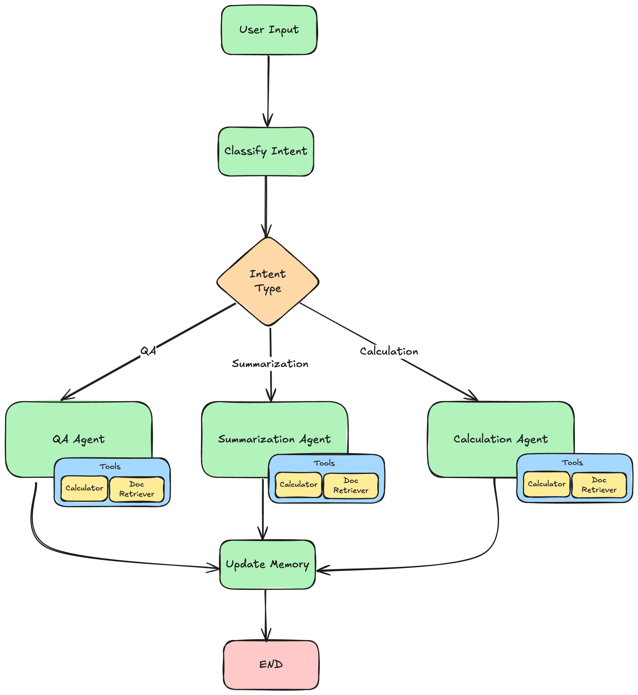

# Healthcare Document Assistant

A multi-agent document processing system built with LangChain and LangGraph. Processes healthcare and financial documents to answer questions, generate summaries, and perform calculations.

## Architecture

```
User Input
    ↓
classify_intent  ←── classifies intent using UserIntent schema
    ↓
[qa_agent | summarization_agent | calculation_agent]
    ↓
update_memory  ←── summarizes conversation, tracks documents
    ↓
END

```

The LangGraph agent follows this workflow:



### Agents
- **Q&A Agent** — answers questions about document content with source citations
- **Summarization Agent** — extracts key insights and structures document summaries
- **Calculation Agent** — retrieves documents and performs mathematical operations using the calculator tool

### Tools
- **document_search** — searches documents by keyword, type, or amount range
- **document_reader** — reads full content of a document by ID
- **calculator** — safely evaluates mathematical expressions using eval() with input validation
- **document_statistics** — returns aggregate stats across the document collection

## State and Memory

State is defined as a TypedDict (AgentState) and flows through every node. Each node receives the full state and returns only the fields it updates — LangGraph merges these partial updates back into the shared state.

Key state design decisions:
- messages uses add_messages reducer — LangGraph appends new messages rather than replacing the list
- actions_taken uses operator.add reducer — accumulates which nodes executed each turn
- tools_used resets each turn — shows only current turn's tools
- Chat history passed to agents filters out ToolMessage objects to prevent OpenAI API errors across turns

Memory persists across multiple invocations using InMemorySaver as a checkpointer. Each session is identified by a thread_id (the session ID), so the agent remembers prior conversation context across turns.

## Structured Outputs

Every LLM response is enforced using Pydantic schemas via llm.with_structured_output(Schema):

- UserIntent — intent classification with intent_type (Literal), confidence (0-1), and reasoning
- AnswerResponse — Q&A responses with question, answer, sources, confidence (0-1), and timestamp
- SummarizationResponse — summaries with summary, key_points, and document_ids
- CalculationResponse — calculations with expression, result, and explanation
- UpdateMemoryResponse — memory updates with summary and document_ids

Both AnswerResponse and UserIntent enforce confidence between 0 and 1 using Pydantic's ge=0.0, le=1.0 field constraints.

## Setup

### Prerequisites
- Python 3.9+
- OpenAI API key

### Installation

```bash
cd starter
python -m venv .venv
.venv\Scripts\activate      # Windows
source .venv/bin/activate   # Mac/Linux
pip install -r requirements.txt
```

Create a .env file:
```
OPENAI_API_KEY=your_key_here
```

### Running

```bash
python main.py
```

### Running Tests

```bash
pip install pytest
pytest test_schemas.py -v
```

Expected output:
```
collected 14 items

test_schemas.py::TestAnswerResponse::test_valid_answer_response PASSED
test_schemas.py::TestAnswerResponse::test_confidence_above_1_rejected PASSED
test_schemas.py::TestAnswerResponse::test_confidence_below_0_rejected PASSED
test_schemas.py::TestAnswerResponse::test_confidence_boundary_values PASSED
test_schemas.py::TestAnswerResponse::test_sources_defaults_to_empty_list PASSED
test_schemas.py::TestAnswerResponse::test_timestamp_auto_generated PASSED
test_schemas.py::TestUserIntent::test_valid_qa_intent PASSED
test_schemas.py::TestUserIntent::test_valid_summarization_intent PASSED
test_schemas.py::TestUserIntent::test_valid_calculation_intent PASSED
test_schemas.py::TestUserIntent::test_valid_unknown_intent PASSED
test_schemas.py::TestUserIntent::test_invalid_intent_type_rejected PASSED
test_schemas.py::TestUserIntent::test_confidence_above_1_rejected PASSED
test_schemas.py::TestUserIntent::test_confidence_below_0_rejected PASSED
test_schemas.py::TestUserIntent::test_confidence_boundary_values PASSED

14 passed in 0.10s
```

## Example Conversations

**Q&A — Document lookup:**
```
User:      What's the total amount in invoice INV-001?
Assistant: The total amount is $22,000 (subtotal $20,000 + tax $2,000)
Intent:    qa | Tools: document_reader
```

**Calculation — Sum across multiple documents:**
```
User:      Calculate the sum of all invoice totals
Assistant: The sum of all invoice totals is $305,800 (INV-001 + INV-002 + INV-003)
Intent:    calculation | Tools: document_search, document_reader, calculator
```

**Q&A — Amount filtering:**
```
User:      Find documents with amounts over $50,000
Assistant: INV-003: $214,500 | CON-001: $180,000 | INV-002: $69,300
Intent:    qa | Tools: document_search
```

**Summarization — Contract summary:**
```
User:      Summarize all contracts
Assistant: CON-001 Service Agreement — $180,000 over 12 months at $15,000/month
           between DocDacity Solutions and Healthcare Partners LLC
Intent:    summarization | Tools: document_search, document_reader
```

## Tech Stack

LangChain · LangGraph · OpenAI GPT-4o · Pydantic · Pytest · Python 3.9+
